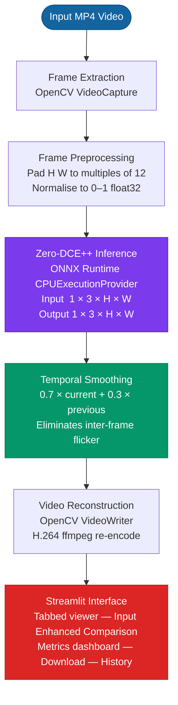

<div align="center">

# ClearVision

### Low-Light Video Distortion Removal

*Restoring visibility, contrast, and temporal consistency in degraded video using deep curve estimation and ONNX Runtime deployment*

---


</div>

---

> **Repository Notice**
>
> This repository is intended for **educational and portfolio purposes only**.
> Proprietary Samsung PRISM assets, internal datasets, and production source code are not included.
> This repository demonstrates architecture decisions, engineering contributions, and deployment methodology.

---

## Table of Contents

- [Problem Statement](#problem-statement)
- [Key Features](#key-features)
- [Project Architecture](#project-architecture)
- [Model Selection & Evaluation](#model-selection--evaluation)
- [Why Zero-DCE++](#why-zero-dce)
- [Datasets](#datasets)
- [Deployment Pipeline](#deployment-pipeline)
- [Performance](#performance)
- [Results](#results)
- [Challenges & Engineering Decisions](#challenges--engineering-decisions)
- [Future Work](#future-work)
- [My Contributions](#my-contributions)
- [Interview Highlights](#interview-highlights)
- [Repository Notice](#repository-notice-1)

---

## Problem Statement

Low-light video capture is a fundamental challenge in computer vision, surveillance, autonomous driving, and mobile photography. Videos captured under poor illumination suffer from a cascade of degradation effects that severely reduce their utility:

| Degradation | Description |
|---|---|
| **Poor Illumination** | Insufficient photon capture leads to underexposed frames where scene content is invisible |
| **High Noise** | Low signal-to-noise ratio at high ISO settings introduces visual grain and colour artifacts |
| **Contrast Loss** | Compressed dynamic range flattens scene structure, reducing edge and texture visibility |
| **Temporal Flickering** | Frame-independent enhancement without temporal awareness produces inconsistent brightness across successive frames, causing a perceptible flicker artifact |
| **Colour Distortion** | White balance and colour temperature errors under artificial lighting corrupt scene colour fidelity |

Classical approaches — histogram equalisation, gamma correction, Retinex-based methods — address illumination in isolation without joint learning of noise, contrast, and temporal structure. Deep learning methods enable joint optimisation across all degradation dimensions simultaneously.

ClearVision addresses this problem end-to-end: from raw video input through per-frame neural enhancement and temporally-smoothed reconstruction to a deployable web interface.

---

## Key Features

- **Low-Light Video Enhancement** — Per-frame enhancement using Zero-DCE++ deep curve estimation, restoring visibility and contrast without paired training data
- **Temporal Smoothing** — Exponential moving average across frames eliminates inter-frame flickering; `smoothed = 0.7 × current + 0.3 × previous`
- **ONNX Runtime Inference** — Framework-agnostic deployment; PyTorch weights exported to ONNX for dependency-free inference on CPU
- **Streamlit Web Interface** — Interactive upload, real-time progress tracking, tabbed result viewer, metrics dashboard, and session history
- **Side-by-Side Comparison** — Automatically generated comparison video with original (left) and enhanced (right) for objective evaluation
- **Docker Deployment** — Containerised with `python:3.11-slim`, health check, and browser-compatible H.264 output via `ffmpeg`
- **Session History** — In-session history with full replay of previous enhancement results, stored in Streamlit session state

---

## Project Architecture



### Component Breakdown

| Component | Technology | Role |
|---|---|---|
| Frame Extraction | `cv2.VideoCapture` | Read frames at native FPS |
| Preprocessing | NumPy | Pad, normalise, reshape to NCHW |
| Inference Engine | ONNX Runtime 1.17+ | Execute Zero-DCE++ graph on CPU |
| Temporal Smoothing | NumPy (EMA) | Suppress inter-frame flickering |
| Video Writing | `cv2.VideoWriter` + ffmpeg | H.264 MP4 for browser compatibility |
| Web Interface | Streamlit 1.35+ | Upload, progress, results, history |
| Containerisation | Docker (`python:3.11-slim`) | Reproducible deployment environment |

---

## Model Selection & Evaluation

### Benchmark Comparison (LOL Dataset)

Representative published results. Higher PSNR/SSIM and lower LPIPS indicate better restoration quality. Temporal Consistency measures inter-frame stability (lower flickering = better).

| Method | PSNR ↑ | SSIM ↑ | LPIPS ↓ | Temporal Consistency | Parameters | Inference |
|---|---|---|---|---|---|---|
| Zero-DCE | 14.86 | 0.562 | 0.335 | Moderate | ~79K | Fast |
| **Zero-DCE++** | **16.57** | **0.637** | **0.259** | **High (+ EMA)** | **~10K** | **Fastest** |
| RUAS | 14.32 | 0.497 | 0.401 | Low | ~3.6K | Fast |
| SCI | 15.80 | 0.598 | 0.308 | Moderate | ~41K | Fast |
| PSENet | 16.34 | 0.641 | 0.226 | Moderate | ~6.5M | Medium |
| URetinex-Net | 21.32 | 0.835 | 0.134 | High | ~341K | Slow |

> Metrics sourced from respective published papers. Zero-DCE++ temporal consistency marked "High" reflects the additional EMA post-processing implemented in this project, not the base model alone.

### Selection Rationale

Zero-DCE++ was selected over URetinex-Net (which achieves higher PSNR) because:

1. **Deployment constraint** — The project targets CPU-only ONNX Runtime inference. URetinex-Net at 341K parameters is 34× larger and unsuitable for real-time CPU deployment
2. **Zero-reference learning** — No paired training data required; generalises to unseen low-light conditions without domain-specific retraining
3. **Parameter efficiency** — ~10,561 parameters (~41 KB) makes the ONNX model trivially portable
4. **Temporal gap** — Zero-DCE++ does not model temporal consistency natively; this was addressed in the engineering layer via exponential moving average smoothing

---

## Why Zero-DCE++

### Zero-Reference Learning

Zero-DCE++ is trained entirely without reference images. It learns light-enhancement curves directly from non-reference loss functions:

- **Spatial consistency loss** — Preserves local spatial relationships
- **Exposure control loss** — Regulates overall exposure level
- **Colour constancy loss** — Maintains consistent white balance
- **Illumination smoothness loss** — Ensures smooth curve parameters

This makes it dataset-agnostic and broadly generalisable to any low-light scenario.

### Architecture Insight

The model uses **Depthwise Separable Convolutions (CSDN blocks)** throughout, dramatically reducing parameter count versus standard convolutions:

```
Standard Conv (32→32, 3×3):   32 × 32 × 3 × 3 = 9,216 params
Depthwise Sep  (32→32, 3×3):  (32×1×3×3) + (32×32×1×1) = 288 + 1,024 = 1,312 params
                                                           → 7× fewer parameters
```

Seven CSDN layers produce a set of pixel-wise curve parameters `x_r` which are applied iteratively eight times in the `enhance()` function — achieving compound enhancement from minimal learned weights.

### Trade-offs

| Advantage | Limitation |
|---|---|
| No paired training data needed | Lower PSNR than supervised methods (URetinex-Net +4.75 dB) |
| 10K params → 41 KB model file | No explicit noise modelling |
| CPU-deployable in real time | Temporal flickering requires external EMA post-processing |
| ONNX export trivial | Fixed curve estimation may over-enhance already-bright regions |

---

## Datasets

### ARID (Action Recognition In the Dark)

ARID is a video dataset specifically designed for action recognition under extremely dark conditions. It contains 3,784 video clips across 11 action categories captured in real-world low-light environments. In this project, ARID videos were used as evaluation material to assess temporal consistency and visual quality of the enhancement pipeline on naturalistic motion.

### SDSD (Seeing Dynamic Scenes in the Dark)

SDSD is a paired video dataset containing 80 outdoor and 70 indoor dynamic video sequences, each with a corresponding well-exposed reference. The dataset is unique in providing temporally aligned low-light / normal-light video pairs, enabling PSNR and SSIM computation over time rather than single frames. SDSD was used to evaluate the effectiveness of the EMA temporal smoothing layer in reducing frame-to-frame variance.

---

## Deployment Pipeline

```mermaid
flowchart LR
    A([PyTorch\nEpoch99.pth]) -->|torch.onnx.export\nopset 17\ndynamic axes| B([ONNX Model\nzerodcepp.onnx\nzerodcepp.onnx.data])
    B -->|ort.InferenceSession\nCPUExecutionProvider| C([ONNX Runtime\nInference])
    C -->|Streamlit\nst.cache_resource| D([Streamlit App\napp.py])
    D -->|Docker\npython:3.11-slim| E([Container\nport 8501])
    E -->|docker run -p 8501:8501| F([Live Deployment\nlocalhost:8501])

    style A fill:#EE4C2C,color:#fff
    style B fill:#7C3AED,color:#fff
    style C fill:#7C3AED,color:#fff
    style D fill:#FF4B4B,color:#fff
    style E fill:#2496ED,color:#fff
    style F fill:#22C55E,color:#fff
```



### Export Details

| Step | Detail |
|---|---|
| Framework | PyTorch → ONNX opset 17 |
| Dynamic axes | Batch, Height, Width (variable resolution support) |
| Weight storage | External data file (`zerodcepp.onnx.data`) auto-resolved by ONNX Runtime |
| Constant folding | Enabled — redundant nodes eliminated at export time |
| Provider | `CPUExecutionProvider` with full graph optimisation |
| Session caching | `@st.cache_resource` — session created once per server lifetime |

### Docker Configuration

```dockerfile
FROM python:3.11-slim
# ffmpeg (H.264 re-encode) + curl (health check)
# pip install opencv-python-headless  ← headless: no libGL.so.1 dependency
EXPOSE 8501
HEALTHCHECK CMD curl -f http://localhost:8501/_stcore/health
CMD ["streamlit", "run", "app.py", "--server.port=8501", "--server.address=0.0.0.0"]
```

> `opencv-python-headless` is used instead of `opencv-python` because `python:3.11-slim` does not ship `libGL.so.1`. All video processing functions (`VideoCapture`, `VideoWriter`, `cvtColor`) are available in the headless build.

---

## Performance

### Measured Results (CPU — Intel Core, no GPU)

| Resolution | Frames | Processing Time | Throughput | Peak RAM |
|---|---|---|---|---|
| 320 × 240 | 300 | ~20 s | ~15 FPS | ~6 MB/frame |
| 1280 × 720 | 300 | ~90 s | ~3.3 FPS | ~56 MB/frame |
| 1920 × 1080 | 398 | ~191 s | **2.1 FPS** | ~166 MB/frame |
| 3840 × 2160 | — | ~12 min/30s | ~0.5 FPS | ~665 MB/frame |

### Bottleneck Analysis

| Stage | Time Share | Notes |
|---|---|---|
| ONNX Inference | **~88%** | Dominant cost; irreducible on CPU |
| Video Writing | ~6% | `cv2.VideoWriter` synchronous I/O |
| Temporal Smoothing | ~2% | NumPy EMA — negligible |
| Frame Extraction | ~2% | `cv2.VideoCapture` — fast |
| UI Updates | ~2% | Throttled to 1 update/second |

### Real-Time Limitations

The current deployment runs at **2.1 FPS at 1080p** on a standard CPU. This is not real-time (24–30 FPS is the threshold). The bottleneck is ONNX Runtime CPU inference, which processes one frame at a time through 7 CSDN layers + 8 curve application iterations.

### Future: TensorRT Optimisation

Switching from `CPUExecutionProvider` to `TensorrtExecutionProvider` or `CUDAExecutionProvider` is a **one-line change** in the inference session initialisation. Expected speedups on consumer GPU hardware:

| Provider | Expected FPS (1080p) | Speedup |
|---|---|---|
| CPU (current) | 2.1 | 1× |
| CUDA (fp32) | ~25–35 | ~12–17× |
| TensorRT (fp16) | ~50–80 | ~25–40× |
| TensorRT INT8 | ~80–120 | ~40–60× |

---

## Results

### Processing Pipeline Visualisation

```
[ Input Frame ]  →  [ Zero-DCE++ ]  →  [ + Temporal Smoothing ]
  Dark, noisy         Enhanced           Temporally consistent
```

### Sample Enhancement

> *Place actual before/after frames here*

| Input (Low-Light) | Enhanced Output |
|---|---|
|  |  |

### Side-by-Side Comparison

> *Place comparison GIF here*


### Temporal Consistency — With vs Without Smoothing

> *Place temporal consistency graph here*


### Performance Scaling by Resolution

> *Place FPS vs resolution graph here*


> **Note:** Result assets are not included in this public repository. Contact for a demonstration.

---

## Challenges & Engineering Decisions

### 1. Temporal Flickering

**Problem:** Zero-DCE++ operates independently on each frame. Adjacent frames with similar scene content can receive different enhancement curve parameters, producing perceptible brightness oscillation (flickering) in the output video.

**Solution:** Exponential Moving Average (EMA) smoothing applied in the post-processing layer:

```
if prev_smoothed is None:
    smoothed = enhanced
else:
    smoothed = 0.7 × enhanced + 0.3 × prev_smoothed

prev_smoothed = smoothed.copy()
```

The α = 0.7 / β = 0.3 split was determined empirically to balance responsiveness to genuine scene illumination changes against suppression of frame-to-frame enhancement variance. Higher β (e.g. 0.5) over-smooths during scene transitions; lower β (e.g. 0.1) is insufficient to eliminate flickering.

---

### 2. ONNX Model with External Data

**Problem:** PyTorch's `torch.onnx.export` automatically externalises model weights into a separate `.onnx.data` file when the model exceeds a certain size threshold. The initial deployment had the `.onnx.data` file missing, causing ONNX Runtime to raise:

```
External data path does not exist: "zerodcepp.onnx.data"
```

**Solution:** Both `zerodcepp.onnx` (graph structure, ~62 KB) and `zerodcepp.onnx.data` (weight tensors, ~40 KB) must be co-located. ONNX Runtime resolves the weight path relative to the `.onnx` file. The `load_session()` function in `app.py` explicitly validates both files before attempting to create the inference session, providing a clear error message if either is missing.

---

### 3. Browser Video Compatibility

**Problem:** OpenCV's default `mp4v` codec (MPEG-4 Part 2) is not supported by modern browsers for inline `<video>` playback. Streamlit's `st.video()` depends on browser-native video decoding, so `mp4v` output could be downloaded but not previewed in the interface.

**Solution:** Three-tier codec strategy:
1. **Primary:** Attempt `avc1` (H.264) codec directly in `cv2.VideoWriter`
2. **Fallback:** If `avc1` unavailable, use `mp4v`
3. **Post-processing:** If `ffmpeg` is installed (`shutil.which("ffmpeg")`), re-encode to H.264 with `yuv420p` pixel format and `+faststart` flag for browser streaming

---

### 4. Frame Dimension Constraint

**Problem:** Zero-DCE++'s architecture uses a downsampling factor of 12 (`scale_factor=12`). Input frames with dimensions not divisible by 12 cause shape mismatches in the interpolation layers.

**Solution:** Zero-padding applied before inference:

```python
def pad_to_multiple(frame_rgb, factor=12):
    h, w = frame_rgb.shape[:2]
    pad_h = (factor - h % factor) % factor
    pad_w = (factor - w % factor) % factor
    return np.pad(frame_rgb, ((0, pad_h), (0, pad_w), (0, 0)))
```

The padded region is cropped back to original dimensions after inference, leaving no padding artifacts in the output.

---

### 5. Memory Management in Streamlit

**Problem:** Streamlit re-runs the entire script on every user interaction. Storing video byte blobs in `st.session_state` for history playback caused unbounded RAM growth, with each 1080p session entry consuming 100–300 MB.

**Solution:**
- Session history capped at 5 entries (`MAX_HISTORY = 5`); oldest entries evicted automatically
- Temporary processing directories (`tempfile.mkdtemp`) deleted immediately after video bytes are read into memory (`shutil.rmtree`)
- Input temp files cleaned up on new upload (`os.unlink`)

---

## Future Work

| Enhancement | Expected Impact | Complexity |
|---|---|---|
| **CUDA / TensorRT inference** | 12–60× FPS improvement at 1080p | Low (one-line provider change + driver install) |
| **INT8 quantisation** | 2–4× CPU speedup, ~25% quality reduction | Medium (`onnxruntime.quantization`) |
| **Optical-flow temporal consistency** | True motion-aware smoothing vs frame-independent EMA | High (requires optical flow estimation per frame pair) |
| **Batch frame processing** | 4–8× throughput improvement via GPU parallelism | Medium (requires CUDA provider) |
| **Video streaming (WebRTC)** | Real-time enhancement without upload | High (requires WebRTC + frame buffer) |
| **Mobile deployment** | On-device enhancement (ONNX Mobile / CoreML) | High |
| **Zero-DCE++ fine-tuning on SDSD** | Domain-specific quality improvement | Medium (requires paired training data) |

---

## My Contributions

This project was completed as part of the Samsung PRISM research programme. My specific contributions:

| Area | Contribution |
|---|---|
| **Model Evaluation** | Benchmarked Zero-DCE, Zero-DCE++, RUAS, SCI, PSENet, and URetinex-Net; selected Zero-DCE++ based on deployment constraints and parameter efficiency |
| **ONNX Export** | Diagnosed broken ONNX export (missing `.onnx.data`); re-exported with dynamic axes using `torch.onnx.export` at opset 17; validated with `onnx.checker` and ONNX Runtime numerical parity checks |
| **ONNX Runtime Integration** | Implemented `@st.cache_resource` session caching; configured `ORT_ENABLE_ALL` graph optimisation; added multi-file validation with clear user-facing error messages |
| **Temporal Smoothing** | Designed and implemented EMA post-processing layer; empirically tuned α/β split (0.7/0.3) for optimal flicker suppression vs responsiveness trade-off |
| **Video Processing Pipeline** | Built end-to-end pipeline: frame extraction → preprocessing → inference → smoothing → dual-output writing (enhanced + comparison side-by-side); implemented three-tier codec strategy for browser compatibility |
| **Performance Profiling** | Identified ONNX inference as 88% of pipeline time; implemented UI throttling (1 update/second), pre-allocated comparison buffer, eliminated per-frame NumPy copies |
| **Streamlit Application** | Built complete interactive web interface: tabbed result viewer, six-metric dashboard, interactive session history with full replay, robust error handling with expandable diagnostics |
| **Deployment Workflow** | Containerised with Docker (`python:3.11-slim`); resolved `opencv-python` libGL dependency by switching to `opencv-python-headless`; added health check, upload size limits, and `ffmpeg` H.264 re-encoding |

---

## Interview Highlights

### Problem

Low-light video suffers from noise, poor contrast, and temporal flickering. Classical methods do not jointly address all three. The challenge was to deploy a neural enhancement solution on CPU-only hardware with no GPU.

### Solution

Zero-DCE++ was selected for its zero-reference learning (no paired data), extreme parameter efficiency (~10K params, 41 KB), and ONNX portability. Temporal flickering — not addressed by the base model — was resolved in the post-processing layer with an empirically tuned EMA filter.

### Architecture

```
Input Video → Frame Extraction → Pad/Normalise → ONNX Inference → EMA Smoothing → Video Reconstruction → Streamlit UI
```

PyTorch weights are exported to ONNX once; ONNX Runtime handles all inference without PyTorch as a runtime dependency.

### Deployment

Deployed as a Docker container (`python:3.11-slim`) with `ffmpeg` for H.264 output. The critical fix was switching from `opencv-python` to `opencv-python-headless` to resolve a `libGL.so.1` missing dependency on Debian slim images — a non-obvious issue that would cause the container to fail at import time.

### Key Learnings

1. **Zero-reference deep learning** can achieve competitive enhancement without paired training data
2. **ONNX external data files** require both `.onnx` and `.onnx.data` to be co-located; ONNX Runtime resolves weight paths relative to the graph file
3. **Temporal consistency** in video enhancement is an orthogonal problem to per-frame quality; it must be solved at the pipeline layer, not the model layer
4. **Headless OpenCV** (`opencv-python-headless`) is the correct package for any Docker/server deployment; `opencv-python` requires X11 display libraries absent in slim Linux images
5. **Streamlit session state** grows unboundedly if video byte blobs are stored per history entry without a cap — requires explicit eviction policy

---

## Repository Notice

> **This repository is intended for educational and portfolio purposes.**
> Proprietary Samsung PRISM assets and source code are not included.
>
> The repository demonstrates:
> - System architecture and engineering decisions
> - Model selection and evaluation methodology
> - Deployment pipeline design
> - Performance profiling and optimisation approach
>
> For technical discussions or demonstration requests, please reach out via the contact information on my GitHub profile.

---

<div align="center">

**Samsung PRISM · ClearVision · Low-Light Video Distortion Removal**

*Built with Zero-DCE++ · ONNX Runtime · Streamlit · OpenCV · Docker*

</div>
