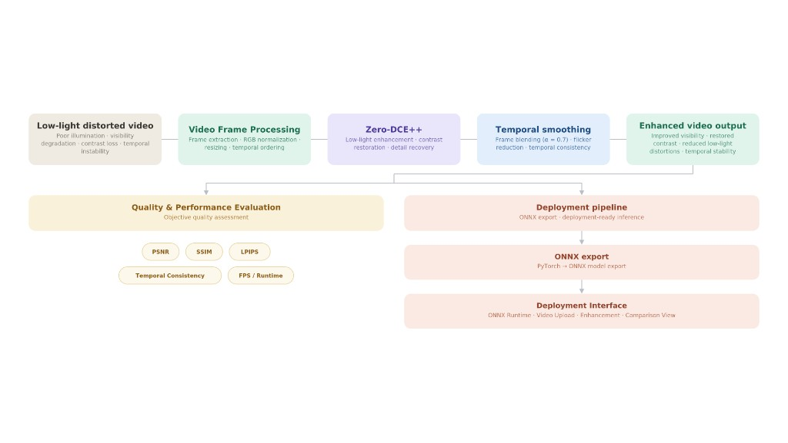
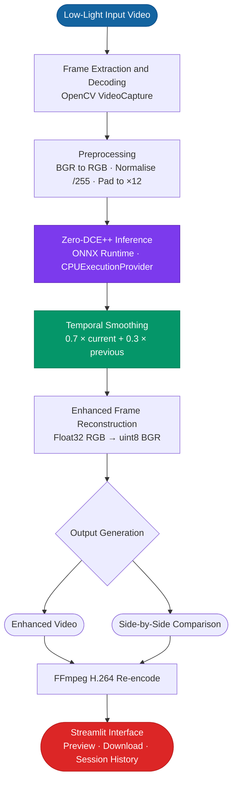
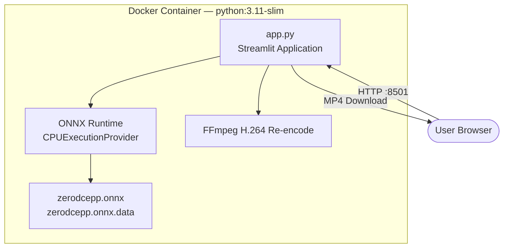
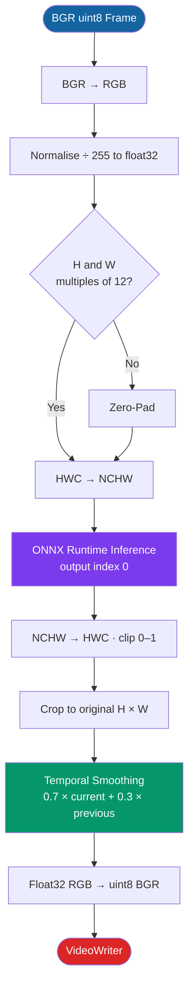
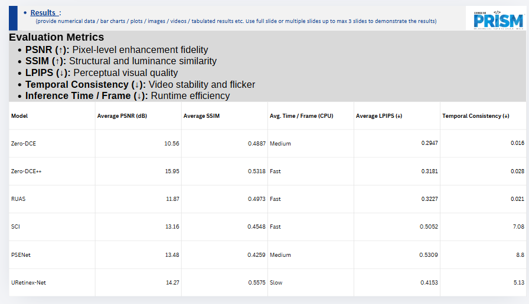
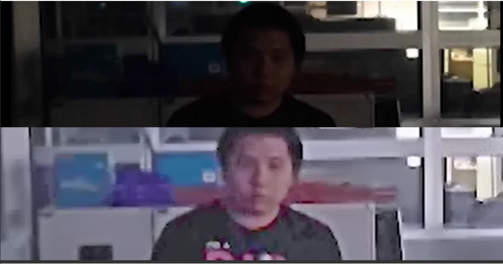
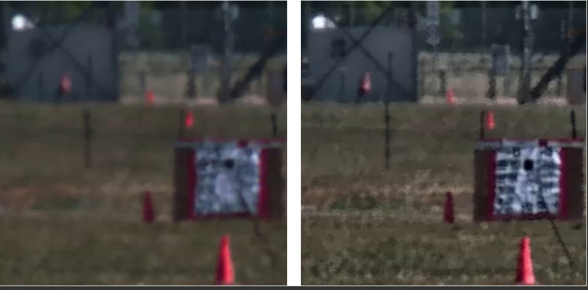

<div align="center">

# ClearVision

### Low-Light Video Distortion Removal

*Restoring visibility, contrast, and temporal consistency in degraded video using deep curve estimation and ONNX Runtime deployment*

---

[](https://www.python.org/)
[](https://pytorch.org/)
[](https://onnxruntime.ai/)
[](https://streamlit.io/)
[](https://opencv.org/)
[](https://www.docker.com/)
[](https://www.samsungprism.com/)
[](https://low-light-video-distortion-removal.streamlit.app/)

**[Live Demo → low-light-video-distortion-removal.streamlit.app](https://low-light-video-distortion-removal.streamlit.app/)**

</div>

---

> **Repository Notice**
>
> This repository is intended for **educational and portfolio purposes only**.
> Proprietary Samsung PRISM assets, internal datasets, and production source code are not included.
> This repository demonstrates architecture decisions, engineering contributions, and deployment methodology.

---

## Table of Contents

1. [Project Overview](#1-project-overview)
2. [Problem Statement](#2-problem-statement)
3. [Objectives](#3-objectives)
4. [Key Features](#4-key-features)
5. [Datasets](#5-datasets)
6. [System Architecture](#6-system-architecture)
7. [Processing Pipeline](#7-processing-pipeline)
8. [Model Description — Zero-DCE++](#8-model-description--zero-dce)
9. [Temporal Smoothing](#9-temporal-smoothing)
10. [Deployment Architecture](#10-deployment-architecture)
11. [Live Demo](#11-live-demo)
12. [Inference Workflow](#12-inference-workflow)
13. [Performance](#13-performance)
14. [Model Selection & Evaluation](#14-model-selection--evaluation)
15. [Results](#15-results)
16. [Challenges & Engineering Decisions](#16-challenges--engineering-decisions)
17. [Technologies Used](#17-technologies-used)
18. [Future Work](#18-future-work)
19. [My Contributions](#19-my-contributions)
20. [Interview Highlights](#20-interview-highlights)
21. [Repository Notice](#21-repository-notice)

---

## 1. Project Overview

**ClearVision** is a Samsung PRISM research project that addresses video quality degradation in low-light environments. The system implements an end-to-end pipeline — from model training in PyTorch to production-grade inference via ONNX Runtime — wrapped in an interactive Streamlit web interface deployed on Streamlit Community Cloud.

The core enhancement engine is **Zero-DCE++** (Zero-Reference Deep Curve Estimation), a lightweight unsupervised model that enhances illumination through learned higher-order curves applied iteratively to each frame. Temporal flickering — an artifact not addressed by the base model — is suppressed by an Exponential Moving Average post-processing layer designed and tuned as part of this project.

> **Programme:** Samsung Research Institute Bangalore (SRIB) — PRISM (Pro-Bono Research and Innovation for Samsung Mentorship)

---

## 2. Problem Statement

Low-light video capture is a fundamental challenge in computer vision, surveillance, autonomous driving, and mobile photography. Videos captured under poor illumination suffer from a cascade of degradation effects that severely reduce their utility:

| Degradation | Description |
|---|---|
| **Insufficient Illumination** | Scenes appear dark; fine details are indistinguishable |
| **Reduced Contrast** | Colour channels compress, flattening visual depth |
| **Temporal Flickering** | Per-frame processing introduces brightness inconsistency across adjacent frames |
| **Noise Amplification** | Low-light conditions elevate sensor noise and grain |
| **Colour Distortion** | White balance errors under artificial or absent light |

Classical approaches — histogram equalisation, gamma correction, Retinex-based methods — address illumination in isolation without joint learning of noise, contrast, and temporal structure. Zero-reference deep learning overcomes this by learning adaptive, content-aware strategies without paired training data.

---

## 3. Objectives

- Train a Zero-DCE++ model for content-aware, parameter-efficient low-light enhancement.
- Deploy via ONNX Runtime for CPU inference without a GPU requirement.
- Apply temporal smoothing to suppress inter-frame flickering in enhanced video output.
- Generate enhanced and side-by-side comparison videos for objective evaluation.
- Provide a web application interface deployable both via Docker and Streamlit Community Cloud.
- Evaluate Zero-DCE++ against five competing methods (Zero-DCE, RUAS, SCI, PSENet, URetinex-Net) using PSNR, SSIM, LPIPS, and Temporal Consistency.

---

## 4. Key Features

| Feature | Description |
|---|---|
| **Zero-DCE++ Enhancement** | Unsupervised illumination enhancement via learned higher-order curves — no paired data required |
| **ONNX Runtime Inference** | CPU-optimised, cross-platform — no GPU required |
| **Temporal Smoothing** | EMA blend of consecutive frames suppresses inter-frame flickering |
| **Side-by-Side Comparison** | Auto-generated comparison video (original left, enhanced right) |
| **Session History** | Stores up to 5 past sessions with metrics, fully reloadable in-app |
| **Streamlit Web Interface** | Interactive browser-based UI with progress tracking and tabbed results |
| **Docker Deployment** | Single-command containerised deployment with health check |
| **FFmpeg H.264 Re-encoding** | Automatic re-encode for broad browser playback compatibility |
| **Frame Padding** | Automatic zero-padding to satisfy the model's stride-12 spatial constraint |

---

## 5. Datasets

Two publicly available datasets were used as primary sources for training and evaluation:

| Dataset | Description | Source |
|---|---|---|
| **ARID v1.5** | Action Recognition in the Dark — 3,784 real low-light video clips across 11 action categories, captured in genuinely dark environments | [Kaggle](https://www.kaggle.com/datasets/uom200682t/arid-v15) |
| **SDSD / Low-Light Video Dataset** | Paired low-light and normal-light video sequences for enhancement benchmarking; temporally aligned pairs enable PSNR/SSIM computation over time | [Kaggle](https://www.kaggle.com/datasets/c00dbddeb80582e1b044807ec50381ef2e3c0ed4c7e08faeed25dcefafa5ac71) |

ARID videos were used to assess temporal consistency and visual quality on naturalistic motion. The SDSD paired sequences enabled frame-level PSNR and SSIM evaluation of both the base enhancement and the EMA temporal smoothing layer.

---

## 6. System Architecture





### Component Breakdown

| Component | Technology | Role |
|---|---|---|
| Frame Extraction | `cv2.VideoCapture` | Read frames at native FPS |
| Preprocessing | NumPy | Pad, normalise, reshape to NCHW |
| Inference Engine | ONNX Runtime 1.17+ | Execute Zero-DCE++ graph on CPU |
| Temporal Smoothing | NumPy (EMA) | Suppress inter-frame flickering |
| Video Writing | `cv2.VideoWriter` + ffmpeg | H.264 MP4 for browser compatibility |
| Web Interface | Streamlit 1.35+ | Upload, progress, results, history |
| Containerisation | Docker (`python:3.11-slim`) | Reproducible deployment environment |

---

## 7. Processing Pipeline

Each frame passes through five sequential stages:

| Stage | Operation | Detail |
|---|---|---|
| 1 | Frame Read | `cv2.VideoCapture.read()` |
| 2 | Preprocessing | BGR → RGB, ÷255.0, pad H/W to multiple of 12, HWC → NCHW |
| 3 | Inference | ONNX Runtime `CPUExecutionProvider`, output index 0 only |
| 4 | Temporal Smoothing | `0.7 × F_t + 0.3 × F_{t-1}` (EMA) |
| 5 | Output Generation | Float32 RGB → uint8 BGR → VideoWriter; FFmpeg re-encode runs once post-loop |

The comparison output buffer is pre-allocated once before the frame loop (`np.empty`) — no per-frame allocation. Streamlit UI updates are throttled to once per second to minimise overhead. Per-stage profiling (extraction, inference, smoothing, write, UI) is recorded and displayed in the app metrics dashboard.

---

## 8. Model Description — Zero-DCE++

**Zero-DCE++** (Zero-Reference Deep Curve Estimation, improved) is an unsupervised CNN proposed by Li et al. (IEEE TPAMI 2021) that requires no paired training data. It maps input pixels to enhanced outputs through learned **Light Enhancement Curves (LE-curves)**:

$$\hat{I} = I + \alpha \cdot I \cdot (1 - I)$$

Applied iteratively eight times, this captures complex non-linear illumination adjustments from a single lightweight forward pass.

> **Reference:** Li, C., Guo, C., & Loy, C. C. (2021). *Learning to Enhance Low-Light Image via Zero-Reference Deep Curve Estimation.* IEEE Transactions on Pattern Analysis and Machine Intelligence. [doi:10.1109/TPAMI.2021.3063604](https://doi.org/10.1109/TPAMI.2021.3063604)
> Official implementation: [github.com/Li-Chongyi/Zero-DCE_extension](https://github.com/Li-Chongyi/Zero-DCE_extension)

| Property | Value |
|---|---|
| **Training Paradigm** | Unsupervised / Zero-Reference |
| **Architecture** | 7 Depthwise Separable Conv layers (CSDN blocks), 32 channels |
| **Parameters** | ~10,561 (~41 KB weights) |
| **Input / Output** | RGB float32 normalised [0, 1] — same spatial resolution |
| **Stride Constraint** | H and W must be multiples of 12 |
| **ONNX Tensor Layout** | NCHW — `(1, 3, H_padded, W_padded)` float32 |
| **Deployment Format** | External ONNX data — `zerodcepp.onnx` + `zerodcepp.onnx.data` |
| **Session Caching** | `@st.cache_resource`, `ORT_ENABLE_ALL` graph optimisation |

### Why So Small? Depthwise Separable Convolutions

The model uses **CSDN blocks** throughout, dramatically reducing parameter count:

```
Standard Conv  (32→32, 3×3):   32 × 32 × 3 × 3  = 9,216 params
Depthwise Sep  (32→32, 3×3):   (32×1×3×3) + (32×32×1×1) = 1,312 params
                                                           → 7× fewer parameters
```

Seven CSDN layers produce pixel-wise curve parameters `x_r`, applied iteratively eight times in the `enhance()` function — achieving compound enhancement from a 41 KB model.

---

## 9. Temporal Smoothing

Per-frame processing causes brightness flickering because adjacent frames with similar scene content can receive different enhancement curve parameters. ClearVision suppresses this with an **Exponential Moving Average (EMA)**:

$$F_t^{smoothed} = 0.7 \times F_t^{enhanced} + 0.3 \times F_{t-1}^{smoothed}$$

```python
if prev_smoothed is None:
    smoothed = enhanced
else:
    smoothed = 0.7 * enhanced + 0.3 * prev_smoothed

prev_smoothed = smoothed.copy()
```

The α = 0.7 / β = 0.3 split was determined empirically. Higher β (e.g. 0.5) over-smooths during genuine scene illumination changes; lower β (e.g. 0.1) is insufficient to eliminate flickering. The first frame is initialised as its own enhanced output.

---

## 10. Deployment Architecture

```mermaid
flowchart LR
    A([PyTorch\nEpoch99.pth]) -->|torch.onnx.export\nopset 17 · dynamic axes| B([zerodcepp.onnx\n+ zerodcepp.onnx.data])
    B -->|ort.InferenceSession\nCPUExecutionProvider| C([ONNX Runtime\nInference])
    C -->|st.cache_resource| D([Streamlit App\napp.py])
    D -->|python:3.11-slim| E([Docker Container\nport 8501])
    E -->|docker run -p 8501:8501| F([Deployment\nstreamlit.app / localhost:8501])

    style A fill:#EE4C2C,color:#fff
    style B fill:#7C3AED,color:#fff
    style C fill:#7C3AED,color:#fff
    style D fill:#FF4B4B,color:#fff
    style E fill:#2496ED,color:#fff
    style F fill:#22C55E,color:#fff
```





| Setting | Value |
|---|---|
| Base image | `python:3.11-slim` (Debian) |
| Max upload size | 200 MB |
| Server port | 8501 |
| Health endpoint | `/_stcore/health` — every 30 s, 20 s start grace, 10 s timeout |
| OpenCV package | `opencv-python-headless` (no `libGL.so.1` dependency) |

### ONNX Export Details

| Step | Detail |
|---|---|
| Framework | PyTorch → ONNX opset 17 |
| Dynamic axes | Batch, Height, Width (variable resolution) |
| Weight storage | External data file auto-resolved by ONNX Runtime |
| Constant folding | Enabled — redundant nodes eliminated at export |
| Session caching | `@st.cache_resource` — one session per server lifetime |

---

## 11. Live Demo

The complete end-to-end pipeline is deployed on Streamlit Community Cloud — no installation required:

**[https://low-light-video-distortion-removal.streamlit.app/](https://low-light-video-distortion-removal.streamlit.app/)**

**Workflow:**
1. Upload a low-light MP4 video (≤ 200 MB).
2. Click **Enhance Video** — a real-time progress bar updates during processing.
3. Three output tabs: **Input Video**, **Enhanced Output**, **Side-by-Side Comparison**.
4. Download buttons for both the enhanced and comparison MP4s.
5. Session History panel (sidebar) stores up to 5 past runs, fully reloadable.

---

## 12. Inference Workflow

Per-frame processing inside the enhancement loop:



**Optimisations applied:**
- ONNX session created **once** via `@st.cache_resource`, reused for all frames
- Comparison frame buffer **pre-allocated** before the loop — no per-frame `np.hstack`
- Streamlit UI updates **throttled** to once per second
- Zero-padding computed once per video (constant H × W), not per frame

---

## 13. Performance

### Measured CPU Throughput (Intel Core, no GPU)

| Resolution | Frames | Processing Time | Throughput | Peak Frame RAM |
|---|---|---|---|---|
| 320 × 240 | 300 | ~20 s | ~15 FPS | ~6 MB |
| 1280 × 720 | 300 | ~90 s | ~3.3 FPS | ~56 MB |
| 1920 × 1080 | 398 | **~191 s** | **2.1 FPS** | ~166 MB |
| 3840 × 2160 | — | ~12 min / 30 s | ~0.5 FPS | ~665 MB |

### Per-Stage Bottleneck Analysis

| Stage | Time Share | Notes |
|---|---|---|
| **ONNX Inference** | **~88%** | Dominant cost; irreducible on CPU |
| Video Writing | ~6% | `cv2.VideoWriter` synchronous I/O |
| Frame Extraction | ~2% | `cv2.VideoCapture` — fast |
| Temporal Smoothing | ~2% | NumPy EMA — negligible |
| UI Updates | ~2% | Throttled to 1 update / second |

### Real-Time Limitations

The deployment runs at **2.1 FPS at 1080p** on a standard CPU. The bottleneck is ONNX Runtime CPU inference through 7 CSDN layers + 8 curve iterations. Switching to `CUDAExecutionProvider` or `TensorrtExecutionProvider` is a **one-line change**:

| Provider | Expected FPS (1080p) | Speedup |
|---|---|---|
| CPU — current | 2.1 | 1× |
| CUDA fp32 | ~25–35 | ~12–17× |
| TensorRT fp16 | ~50–80 | ~25–40× |
| TensorRT INT8 | ~80–120 | ~40–60× |

---

## 14. Model Selection & Evaluation

### Benchmark Results — Project Evaluation



| Model | PSNR (dB) ↑ | SSIM ↑ | LPIPS ↓ | Temporal Consistency ↓ | CPU Speed |
|---|---|---|---|---|---|
| Zero-DCE | 10.56 | 0.4887 | 0.2947 | 0.016 | Medium |
| **Zero-DCE++** | **15.95** | **0.5318** | **0.3181** | **0.028** | **Fast** |
| RUAS | 11.87 | 0.4973 | 0.3227 | 0.021 | Fast |
| SCI | 13.16 | 0.4548 | 0.5052 | 7.08 | Fast |
| PSENet | 13.48 | 0.4259 | 0.5309 | 8.80 | Medium |
| URetinex-Net | 14.27 | 0.5575 | 0.4153 | 5.13 | Slow |

> **Metrics:** PSNR — pixel-level fidelity · SSIM — structural and luminance similarity · LPIPS — perceptual visual quality · Temporal Consistency — inter-frame variance (lower = more stable video)

### Why Zero-DCE++ Was Selected

1. **Best PSNR in evaluation** — 15.95 dB, outperforming URetinex-Net (14.27 dB) and all others
2. **Excellent temporal stability** — Score of 0.028; far better than SCI (7.08), PSENet (8.80), URetinex-Net (5.13)
3. **Fastest deployable model with competitive quality** — Fast inference on CPU, unlike Slow-rated URetinex-Net
4. **Zero-reference learning** — No paired training data; generalises to unseen conditions
5. **Extreme parameter efficiency** — ~10,561 parameters, 41 KB ONNX model; trivially portable

| Advantage | Limitation |
|---|---|
| Highest PSNR in project evaluation (15.95 dB) | No explicit noise modelling |
| Excellent temporal stability score (0.028) | Temporal flickering requires external EMA post-processing |
| 10K params → 41 KB model — CPU-deployable | SSIM (0.5318) lower than URetinex-Net (0.5575) |
| No paired training data needed | Fixed curve estimation may over-enhance already-bright regions |

---

## 15. Results

### Sample Enhancement — Indoor Low-Light Scene

Top: original low-light input frame. Bottom: Zero-DCE++ enhanced output with temporal smoothing applied.



---

### Side-by-Side Comparison — Outdoor Scene

Left: original low-light frame. Right: Zero-DCE++ enhanced. Restored detail, contrast, and colour fidelity are visible across the scene.



---

### Final Evaluated Output Videos

The definitive project results — each video shows original (left) and enhanced (right) at native resolution:

| File | Scene |
|---|---|
| `Drink_1_3_comparison.mp4` | Indoor low-light drinking scene |
| `Jump_6_4_comparison.mp4` | Dynamic motion under poor illumination |
| `Pick_10_11_comparison.mp4` | Object interaction in a dark environment |
| `Run_10_11_comparison.mp4` | Fast motion with low-light degradation |
| `Wave_22_35_comparison.mp4` | Subtle motion and texture recovery |

> Output videos are not included in this public portfolio repository. A full end-to-end demonstration is available via the [Live Demo](https://low-light-video-distortion-removal.streamlit.app/).

---

## 16. Challenges & Engineering Decisions

### 1. Temporal Flickering

**Problem:** Zero-DCE++ operates independently on each frame. Adjacent frames receive different curve parameters, producing brightness oscillation.

**Solution:** EMA post-processing with α = 0.7 / β = 0.3 tuned empirically. Higher β (0.5) over-smooths scene transitions; lower β (0.1) is insufficient.

---

### 2. ONNX External Data File

**Problem:** `torch.onnx.export` automatically externalises weights into `zerodcepp.onnx.data`. Initial deployment had this file missing, causing ONNX Runtime to raise:

```
External data path does not exist: "zerodcepp.onnx.data"
```

**Solution:** `load_session()` validates both files at startup and raises a clear `st.error` + `st.stop()` if either is absent. Both files must be co-located alongside `app.py`.

---

### 3. Browser Video Compatibility

**Problem:** OpenCV's default `mp4v` codec (MPEG-4 Part 2) is unsupported by modern browsers for inline `<video>` playback.

**Solution:** Three-tier codec strategy:
1. **Primary** — attempt `avc1` (H.264) in `cv2.VideoWriter`
2. **Fallback** — use `mp4v` if `avc1` unavailable
3. **Post-processing** — if `ffmpeg` present (`shutil.which`), re-encode to H.264 with `yuv420p` + `+faststart`

---

### 4. Frame Dimension Constraint

**Problem:** Zero-DCE++'s `scale_factor=12` causes shape mismatches on non-divisible frame dimensions.

**Solution:** Zero-padding before inference, cropped back after:

```python
def pad_to_multiple(frame_rgb, factor=12):
    h, w = frame_rgb.shape[:2]
    pad_h = (factor - h % factor) % factor
    pad_w = (factor - w % factor) % factor
    return np.pad(frame_rgb, ((0, pad_h), (0, pad_w), (0, 0)))
```

---

### 5. Docker libGL Dependency

**Problem:** `opencv-python` links against `libGL.so.1`, absent in `python:3.11-slim`, causing `ImportError` at container startup.

**Solution:** Switched to `opencv-python-headless` in `requirements.txt`. All functions used (`VideoCapture`, `VideoWriter`, `cvtColor`, `resize`) are fully available in the headless build.

---

### 6. Streamlit Memory Growth

**Problem:** Storing video byte blobs in `st.session_state` per history entry caused unbounded RAM growth (~100–300 MB per 1080p entry).

**Solution:** History capped at `MAX_HISTORY = 5`; oldest entry evicted. Temp dirs deleted with `shutil.rmtree` after bytes are read into memory.

---

## 17. Technologies Used

| Category | Technology | Version | Role |
|---|---|---|---|
| Deep Learning | PyTorch | ≥ 2.0 | Model training and ONNX export |
| Model Format | ONNX | Opset 17 | Portable model serialisation |
| Inference Runtime | ONNX Runtime | ≥ 1.17.0 | CPU inference engine |
| Computer Vision | OpenCV (Headless) | ≥ 4.8.0 | Video I/O, colour conversion, codec handling |
| Numerical Computing | NumPy | ≥ 1.24.0 | Frame-level array manipulation |
| Web Interface | Streamlit | ≥ 1.35.0 | Interactive web application |
| Video Processing | FFmpeg | Any | H.264 re-encoding for browser compatibility |
| Containerisation | Docker | Any | Deployment packaging |
| Language | Python | 3.11 | Implementation language |

---

## 18. Future Work

| Area | Proposed Enhancement | Impact |
|---|---|---|
| **GPU Acceleration** | `CUDAExecutionProvider` — one-line change | 12–60× FPS at 1080p |
| **TensorRT INT8** | Quantised model via `onnxruntime.quantization` | 2–4× CPU speedup |
| **Optical-Flow Smoothing** | Motion-aware warping instead of fixed EMA | True temporal consistency |
| **Batch Processing** | Frame batching for GPU parallelism | Higher throughput |
| **Video Streaming** | WebRTC real-time enhancement pipeline | Eliminates upload step |
| **Mobile Deployment** | ONNX Mobile / CoreML on-device | Edge inference |
| **Model Fine-tuning** | Zero-DCE++ fine-tuned on SDSD paired data | Domain-specific quality |
| **REST API** | FastAPI endpoint for programmatic pipeline access | Integration capability |
| **In-App Metrics** | Live PSNR / SSIM / NIQE computation inside the app | Objective quality feedback |

---

## 19. My Contributions

This project was completed as part of the Samsung PRISM research programme. Specific contributions:

| Area | Contribution |
|---|---|
| **Model Evaluation** | Benchmarked Zero-DCE, Zero-DCE++, RUAS, SCI, PSENet, and URetinex-Net across PSNR, SSIM, LPIPS, Temporal Consistency; selected Zero-DCE++ based on results |
| **ONNX Export** | Diagnosed broken ONNX export (missing `.onnx.data`); re-exported with dynamic axes at opset 17; validated with `onnx.checker` and numerical parity checks against PyTorch |
| **ONNX Runtime Integration** | `@st.cache_resource` session caching; `ORT_ENABLE_ALL` graph optimisation; multi-file validation with clear user-facing error messages |
| **Temporal Smoothing** | Designed and implemented EMA layer; empirically tuned α/β (0.7/0.3) for optimal flicker suppression |
| **Video Processing Pipeline** | End-to-end pipeline: extraction → preprocessing → inference → smoothing → dual-output writing; three-tier codec strategy for browser compatibility |
| **Performance Profiling** | Identified ONNX inference as 88% of pipeline time; implemented UI throttling, pre-allocated comparison buffer, eliminated per-frame allocations |
| **Streamlit Application** | Complete interactive UI: tabbed results, six-metric dashboard, interactive session history with full replay, robust error handling |
| **Deployment Workflow** | Docker containerisation; resolved `opencv-python` libGL issue; health check, upload limits, FFmpeg H.264 pipeline |

---

## 20. Interview Highlights

### Problem
Low-light video suffers from noise, poor contrast, and temporal flickering. Classical methods do not jointly address all three. The constraint was CPU-only deployment with no GPU.

### Solution
Zero-DCE++ selected for zero-reference learning, ~10K parameters (41 KB model), and ONNX portability. It achieved the highest PSNR (15.95 dB) in the project evaluation. Temporal flickering was resolved at the pipeline layer via EMA smoothing.

### Architecture
```
Input Video → Frame Extraction → Pad/Normalise → ONNX Inference → EMA Smoothing → Video Reconstruction → Streamlit UI
```

PyTorch weights exported to ONNX once; ONNX Runtime handles all inference with no PyTorch runtime dependency.

### Deployment
Containerised with Docker (`python:3.11-slim`). Critical fix: switched `opencv-python` → `opencv-python-headless` to resolve `libGL.so.1` missing on Debian slim — a non-obvious failure that causes container crash at import time.

### Key Learnings
1. **Zero-reference deep learning** achieves competitive enhancement without paired training data
2. **ONNX external data files** — both `.onnx` and `.onnx.data` must be co-located; ONNX Runtime resolves weight paths relative to the graph file
3. **Temporal consistency** is orthogonal to per-frame quality — must be solved at the pipeline layer, not the model layer
4. **Headless OpenCV** is the correct package for any Docker/server deployment; `opencv-python` requires X11 libraries absent in slim images
5. **Streamlit session state** requires an explicit eviction policy when storing large byte blobs per history entry

---

## 21. Repository Notice

> **This repository is intended for educational and portfolio purposes.**
> Proprietary Samsung PRISM assets and source code are not included.
>
> The repository demonstrates:
> - System architecture and engineering decisions
> - Model selection and evaluation methodology
> - Deployment pipeline design
> - Performance profiling and optimisation approach
>
> For technical discussions or demonstration requests, please reach out via the contact information on my GitHub profile.

---

<div align="center">

**Samsung PRISM · ClearVision · Low-Light Video Distortion Removal**

*Built with Zero-DCE++, ONNX Runtime, Streamlit, OpenCV, and Docker*

[](https://www.samsungprism.com/)

---

**Acknowledgement:** This project builds on **Zero-DCE++** by Li, Guo, and Loy (IEEE TPAMI 2021).
Official implementation: [github.com/Li-Chongyi/Zero-DCE_extension](https://github.com/Li-Chongyi/Zero-DCE_extension).
The model is used strictly for academic and research purposes.

</div>
